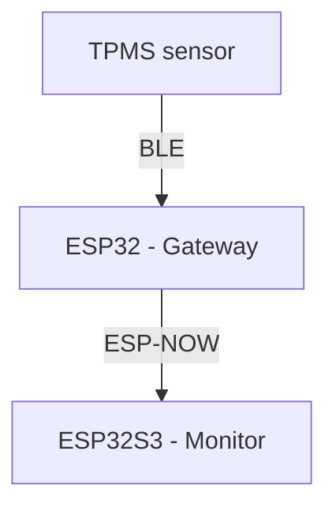

# ESP32 BLE TPMS

This repository contains source files for building a ESP32-based TPMS system with Chinese BLE TPMS sensors

## Architecture

The system consists of a ESP32S3 LCD board for displaying information, a ESP32 (classic) for reading the TPMS sensors and the sensors themselves. Two ESP32s are necessary because it appears that (some) ESP32S3 LCD boards have very poor Bluetooth connectivity (presumably because of the antenna is hidden under the screen).

## BLE protocol

The Chinese LEEPEE BLE TPMS sensors publish their readings inside BLE advertisment packages:
 - bytes 17-24 (little-endian): pressure in Pascals
 - bytes 21-22 (little-endian): temperature (signed) in deg Celsius
 - bytes 14-16: unique part of the address (bytes 11-13 are common to all sensors)

## ESP-NOW protocol
